# Page Pulse ⚡ — Website Performance & SEO Audit Platform

[](backend/tests/)
[](https://github.com/Samarthts)
[](https://fastapi.tiangolo.com)
[](https://react.dev)
[](https://tailwindcss.com)
[](https://vitejs.dev)
[](https://python.org)

> **Page Pulse** is an enterprise-grade, asynchronous SaaS application designed to fetch, parse, and audit website URLs in real time. It evaluates response latency, HTML metadata structure, headings, accessibility alt-attributes, text density, SSL security, and core response headers to compute a deterministic **SEO Health Score (0–100)**.

---

## 📋 Table of Contents
- [Project Overview](#project-overview)
- [System Architecture](#system-architecture)
- [Features](#features)
- [Tech Stack](#tech-stack)
- [Folder Structure](#folder-structure)
- [Installation & Setup](#installation--setup)
  - [Backend Setup](#backend-setup)
  - [Frontend Setup](#frontend-setup)
- [API Contract & cURL Examples](#api-contract)
- [Error Handling & Status Codes](#error-responses)
- [Engineering Design Decisions](#design-decisions)
- [Screenshots](#screenshots-section)
- [Deployment Guide](#deployment)
- [Future Improvements & Architecture Blueprint](#future-improvements)

---

## 🎯 Project Overview

In modern web development, site performance, proper HTML semantics, metadata accessibility, and HTTPS security directly dictate SEO ranking and user retention. **Page Pulse** empowers developers, marketers, and QA teams to run instant diagnostic audits on any publicly accessible web URL.

The platform provides a streamlined workflow:
1. **Target URL Ingestion**: Users enter any domain or page URL with automated protocol sanitization (`https://` prepending).
2. **Asynchronous Scraping & Parsing**: The backend fetches the target URL using `httpx` with timeout protection and parses the DOM tree using `BeautifulSoup`.
3. **Metric Extraction & Scoring**: Evaluates title length, meta description quality, H1 tag counts, image alt accessibility, body word count, HTTPS status, and HTTP security headers.
4. **Interactive Dashboard**: Renders visual score gauges, status badges, diagnostic error notifications, response headers modal, and export options (JSON download, PDF export, clipboard copy).

---

## 🏗️ System Architecture

```mermaid
graph TD
    User["👤 Client Browser"] -->|HTTP POST /analyze| ReactApp["⚛️ React 19 + Vite Frontend"]
    ReactApp -->|Axios JSON Payload| FastApi["⚡ FastAPI Backend (Uvicorn)"]
    
    subgraph Backend Architecture
        FastApi -->|Schema Validation| Pydantic["🛡️ Pydantic v2 (AuditRequest)"]
        Pydantic -->|Valid URL| AnalyzerService["⚙️ WebsiteAnalyzerService"]
        AnalyzerService -->|Async HTTP GET| HTTPX["🌐 HTTPX AsyncClient (10s Timeout)"]
    end

    HTTPX -->|Fetch Web Page| TargetSite["🌐 Target Web Server"]
    TargetSite -->|HTML Response / Headers| HTTPX
    HTTPX -->|Raw HTML| BeautifulSoup["🍲 BeautifulSoup4 Parser"]
    
    subgraph Audit Execution
        BeautifulSoup -->|Extract Title & Meta| MetaExtractor["🏷️ Meta & Title Extractor"]
        BeautifulSoup -->|Count H1 & Img Alt| AccessibilityAuditor["♿ Accessibility & DOM Auditor"]
        BeautifulSoup -->|Extract Body Text| WordCounter["📝 Word Count Utility"]
        BeautifulSoup -->|Resolve Favicon| FaviconResolver["🌐 Favicon Resolver"]
    end

    MetaExtractor & AccessibilityAuditor & WordCounter -->|Extracted Metrics| ScoringEngine["📊 SEO Scoring Engine (0-100)"]
    ScoringEngine -->|AuditResponse JSON| FastApi
    FastApi -->|HTTP 200 / Error Payload| ReactApp
    ReactApp -->|Render Dashboard / Gauges| User
```



---

## ✨ Features

- **⚡ Real-Time Latency Tracking**: Accurately measures server round-trip response time in milliseconds using high-resolution monotonic clocks (`time.perf_counter()`).
- **🏷️ Metadata Extraction**: Validates `<title>` length and `<meta name="description">` character count against search engine guidelines.
- **📊 Semantic HTML Analysis**: Tracks H1 heading presence (detects missing or duplicate H1s).
- **♿ Image Accessibility Audit**: Identifies total `` tags missing non-empty `alt` attributes.
- **📝 Body Text Word Count**: Strips nav, header, footer, script, and style tags to compute true content depth.
- **🔒 HTTPS & Security Verification**: Checks SSL certificate status and extracts critical security headers (`Strict-Transport-Security`, `X-Frame-Options`, `X-Content-Type-Options`).
- **🌐 Favicon Auto-Resolution**: Resolves relative or absolute favicon URLs or falls back to domain-level `/favicon.ico`.
- **📈 Deterministic SEO Health Score**: Generates a weighted score out of 100 based on core page attributes.
- **🎨 Glassmorphic Dark UI**: Modern dark-mode interface built with Tailwind CSS, animated glow blobs, and Framer Motion micro-animations.
- **📄 Export & Share Capabilities**: One-click JSON copy, JSON payload download, and PDF report export.
- **🚨 Diagnostic Error Handling**: User-friendly alerts for connection timeouts, invalid URLs, non-HTML responses, and server errors.

---

## 🛠️ Tech Stack

### Frontend
- **Framework**: React 19 (Vite build toolchain)
- **Styling**: Tailwind CSS (Custom glassmorphism design system)
- **Animations**: Framer Motion
- **Icons**: Lucide React
- **HTTP Client**: Axios (with custom error interceptor mapping)

### Backend
- **Framework**: FastAPI (Asynchronous Python REST API)
- **ASGI Server**: Uvicorn
- **HTTP Client**: HTTPX (Asynchronous network requests with redirects & timeout controls)
- **HTML Parsing**: BeautifulSoup4 (lxml/html.parser backend)
- **Schema Validation**: Pydantic v2

### Testing & Tooling
- **Test Framework**: Pytest 9 + Pytest-Asyncio (36 passing tests)
- **HTTP Mocking**: Unittest.mock (`AsyncMock`) & `TestClient`
- **Linting & Code Quality**: Oxlint / Flake8

### Deployment
- **Frontend**: Vercel Serverless
- **Backend**: Render Web Service

---

## 📁 Folder Structure

```
PagePulse/
├── backend/
│   ├── app/
│   │   ├── config/
│   │   │   └── config.py          # App settings & environment variables
│   │   ├── models/                # Domain models & database primitives
│   │   ├── routes/
│   │   │   └── audit.py           # API endpoints (/analyze, /api/v1/health)
│   │   ├── schemas/
│   │   │   └── audit.py           # Pydantic request/response schemas
│   │   ├── services/
│   │   │   └── analyzer.py        # Core website scraping & parsing service
│   │   ├── utils/
│   │   │   └── helpers.py         # SEO algorithm, word count & favicon utilities
│   │   ├── __init__.py
│   │   └── main.py                # FastAPI initialization & exception handlers
│   ├── tests/
│   │   ├── conftest.py            # TestClient & HTML fixtures
│   │   ├── test_analyzer.py       # Unit tests for scoring & helpers
│   │   ├── test_invalid_url.py    # Pytest suite for 400 Bad Request
│   │   ├── test_non_html.py       # Pytest suite for 415 Non-HTML
│   │   ├── test_routes.py         # Integration tests for API routes
│   │   ├── test_success.py        # Pytest suite for 200 OK analysis
│   │   └── test_timeout.py        # Pytest suite for 504 Timeout
│   ├── render.yaml                # Render deployment configuration
│   └── requirements.txt           # Python dependencies
├── frontend/
│   ├── public/
│   │   └── favicon.svg
│   ├── src/
│   │   ├── components/
│   │   │   ├── AuditDashboard.jsx # Audit report visualizer
│   │   │   ├── ErrorAlert.jsx     # Diagnostic error banner
│   │   │   ├── Footer.jsx         # SaaS footer with internship credit
│   │   │   ├── HeroSection.jsx    # URL input hero & quick tags
│   │   │   ├── LoadingSkeleton.jsx# Animated loading skeleton
│   │   │   ├── LoadingState.jsx   # Micro-stage progress indicator
│   │   │   ├── MetaDescriptionCard.jsx # Meta description auditor
│   │   │   ├── MetricCard.jsx     # Metric display cards
│   │   │   ├── Navbar.jsx         # Glassmorphic top navigation bar
│   │   │   ├── ProgressBar.jsx    # Top progress bar
│   │   │   ├── ResponseHeadersModal.jsx # Headers viewer modal
│   │   │   ├── StatusCard.jsx     # Health status summary
│   │   │   └── UrlInput.jsx       # Sanitized URL search form
│   │   ├── hooks/
│   │   │   └── useAudit.js        # Audit state management hook
│   │   ├── services/
│   │   │   └── api.js             # Axios client API service
│   │   ├── utils/
│   │   │   └── pdfExporter.js     # Client-side PDF generator
│   │   ├── App.jsx                # Main application component
│   │   ├── main.jsx               # Entry point
│   │   └── index.css              # Global styles & glassmorphism utilities
│   ├── package.json
│   ├── vercel.json                # Vercel deployment rewrite rules
│   └── vite.config.js             # Vite config & dev server proxy
├── package.json
└── README.md
```

---

## ⚙️ Installation & Setup

### Prerequisites
- **Python**: `3.10+`
- **Node.js**: `18.0+`
- **npm** or **yarn**

---

### Backend Setup

1. **Navigate to the backend directory**:
   ```bash
   cd backend
   ```

2. **Create and activate a virtual environment**:
   ```bash
   # Windows (PowerShell)
   python -m venv .venv
   .venv\Scripts\Activate.ps1

   # Linux / macOS
   python3 -m venv .venv
   source .venv/bin/activate
   ```

3. **Install dependencies**:
   ```bash
   pip install -r requirements.txt
   ```

4. **Run the FastAPI server locally**:
   ```bash
   uvicorn app.main:app --reload --port 8000
   ```
   The backend API will be available at `http://127.0.0.1:8000`.  
   Interactive API docs: `http://127.0.0.1:8000/docs`.

5. **Run test suite**:
   ```bash
   pytest -v
   ```

---

### Frontend Setup

1. **Navigate to the frontend directory**:
   ```bash
   cd frontend
   ```

2. **Install Node dependencies**:
   ```bash
   npm install
   ```

3. **Start the Vite development server**:
   ```bash
   npm run dev
   ```
   The frontend application will run locally at `http://localhost:5173`.  
   Vite is pre-configured to proxy `/analyze` requests to `http://127.0.0.1:8000`.

---

## 📡 API Contract & cURL Examples

### Endpoint: `POST /analyze`

Analyzes a target URL, measures network latency, parses HTML structure, extracts meta attributes, and computes an SEO health score.

#### Request Headers
```http
Content-Type: application/json
Accept: application/json
```

#### cURL Execution Example
```bash
curl -X POST "http://127.0.0.1:8000/analyze" \
     -H "Content-Type: application/json" \
     -d '{"url": "https://example.com"}'
```

#### Response Example (HTTP 200 OK)
```json
{
  "status": 200,
  "response_time": "245 ms",
  "title": "Example Domain",
  "meta_description": "Example Domain for illustrative examples in documents.",
  "h1_count": 1,
  "missing_alt_images": 0,
  "word_count": 125,
  "favicon": "https://example.com/favicon.ico",
  "https_status": true,
  "response_headers": {
    "content-type": "text/html; charset=UTF-8",
    "server": "ECS (scl/a64b)",
    "cache-control": "max-age=604800"
  },
  "seo_score": 95,
  "timestamp": "2026-07-24T20:45:00Z"
}
```

#### Field Explanations

| Field Name | Type | Description | Example |
| :--- | :--- | :--- | :--- |
| `status` | `integer` | HTTP response status code returned by the target host. | `200` |
| `response_time` | `string` | Round-trip server response latency formatted in milliseconds. | `"245 ms"` |
| `title` | `string \| null` | Text extracted from the HTML `<title>` tag. `null` if missing. | `"Example Domain"` |
| `meta_description` | `string \| null` | Content attribute of `<meta name="description">` or `<meta property="og:description">`. | `"Example Description"` |
| `h1_count` | `integer` | Total number of `<h1>` heading tags present in the DOM tree. | `1` |
| `missing_alt_images` | `integer` | Count of `` tags missing a non-empty `alt` attribute. | `0` |
| `word_count` | `integer` | Approximate word count of body text (excluding nav, footer, script tags). | `125` |
| `favicon` | `string \| null` | Resolved URL of the website's favicon. | `"https://example.com/favicon.ico"` |
| `https_status` | `boolean` | `true` if target URL uses secure HTTPS protocol, `false` otherwise. | `true` |
| `response_headers` | `object` | Key security and caching HTTP response headers from target host. | `{ "server": "nginx" }` |
| `seo_score` | `integer` | Calculated SEO Health Score (0–100) based on core metrics. | `95` |
| `timestamp` | `string` | ISO 8601 UTC timestamp recording when the audit was performed. | `"2026-07-24T20:45:00Z"` |

---

## 🚨 Error Responses

Page Pulse uses standard HTTP status codes and uniform JSON error structures.

```json
{
  "error": true,
  "status_code": 400,
  "message": "Invalid URL or Request Body",
  "detail": "Invalid URL structure. Example: https://example.com"
}
```

### Supported Error Categories & Testing Examples

1. **400 Bad Request — Invalid URL**
   - **cURL**: `curl -X POST "http://127.0.0.1:8000/analyze" -H "Content-Type: application/json" -d '{"url": "invalid-domain"}'`
   - **Detail**: `"Invalid URL structure. Example: https://example.com"`

2. **415 Unsupported Media Type — Non-HTML Response**
   - **cURL**: `curl -X POST "http://127.0.0.1:8000/analyze" -H "Content-Type: application/json" -d '{"url": "https://example.com/file.pdf"}'`
   - **Detail**: `"The URL returned a non-HTML response (application/pdf). Page Pulse can only audit HTML web pages."`

3. **502 Bad Gateway — Connection / SSL Failure**
   - **Detail**: `"Unable to establish connection to host. Check if the URL domain is correct and active."`

4. **504 Gateway Timeout — Request Timeout**
   - **Detail**: `"Request timed out while connecting to target URL. The server took too long to respond."`

---

## 🧠 Engineering Design Decisions

### 1. Framework Selection: FastAPI (Python 3.11+) vs Flask / Django

- **Why I Chose It**: FastAPI provides native Python asynchronous I/O (`async`/`await`), built-in data validation via Pydantic v2, and automatic OpenAPI standard documentation generation.
- **Alternatives Evaluated**:
  - *Flask*: Requires WSGI sync wrappers or manual event loop integration; lacks native Pydantic integration.
  - *Django*: Excessive boilerplate and ORM overhead for a stateless audit API.
- **Advantages**:
  - High throughput for asynchronous HTTP requests (~3x higher concurrency than synchronous Flask).
  - Type-safe schema validation eliminates manual JSON parsing boilerplate.
  - Automatic Swagger (`/docs`) and ReDoc (`/redoc`) documentation endpoints.
- **Trade-offs**: Slightly larger RAM footprint compared to minimal Go or Rust HTTP routers.
- **Future Scalability**: Seamlessly scales horizontally across container instances (Kubernetes / Docker) and integrates easily with async Redis caching and Celery queues.

---

### 2. Frontend Stack: React 19 + Tailwind CSS + Vite vs Next.js / Vue

- **Why I Chose It**: React 19 combined with Vite delivers instant hot-module replacement (HMR), component modularity, and declarative state management. Tailwind CSS provides custom styling without CSS bundle bloat.
- **Alternatives Evaluated**:
  - *Next.js*: Unnecessary server rendering complexity for a client-side analytical dashboard.
  - *Vanilla JS*: Harder to maintain stateful modal flows and dynamic score animations cleanly.
- **Advantages**:
  - Vite provides sub-second development server startup and optimized Rollup production builds.
  - Tailwind utility classes enable custom glassmorphic effects (`backdrop-blur-md`, custom HSL glow blobs) while maintaining a small production CSS bundle.
  - Declarative state management via custom hooks (`useAudit`) isolates API logic from rendering UI.
- **Trade-offs**: Client-side rendering (CSR) requires initial JavaScript loading before initial frame render.
- **Future Scalability**: Components are decoupled into modular atomic cards (`MetricCard`, `StatusCard`, `ErrorAlert`), allowing straightforward migration to Next.js for server-side rendering (SSR) if required.

---

### 3. Scraping Engine: HTTPX + BeautifulSoup4 vs Playwright / Scrapy

- **Why I Chose It**: `httpx` is a modern async HTTP client with HTTP/2 support, strict timeout controls, and automated redirect handling. `BeautifulSoup4` provides robust, fault-tolerant HTML DOM parsing.
- **Alternatives Evaluated**:
  - *Playwright / Selenium*: Heavy headless browser overhead (300MB+ Chromium instance) resulting in 2-5s per request vs 150ms for `httpx`.
  - *Scrapy*: Built for multi-page crawling, over-engineered for single-page audit requests.
- **Advantages**:
  - `httpx` supports asynchronous non-blocking network calls, allowing the API server to handle concurrent audit requests without thread blocking.
  - `BeautifulSoup` handles malformed or non-compliant HTML gracefully without crashing the server.
  - Native content-type inspection prevents unnecessary memory usage when encountering non-HTML resources.
- **Trade-offs**: `BeautifulSoup` operates in-memory; parsing extremely large HTML files (>50MB) incurs CPU cycles.
- **Future Scalability**: Headless browser automation (Playwright / Puppeteer) can be added as an optional fallback layer for dynamic JavaScript-rendered Single Page Applications (SPAs).

---

## 📷 Screenshots Section

> *Below are visual layout representations of the Page Pulse SaaS Dashboard.*

### Main Audit Hero & Search


### Audit Dashboard & SEO Gauge


---

## 🚀 Deployment

### Backend Deployment (Render)
1. Hosted as a Web Service on Render running Python 3.11+.
2. Build Command: `pip install -r requirements.txt`
3. Start Command: `uvicorn app.main:app --host 0.0.0.0 --port $PORT`

### Frontend Deployment (Vercel)
1. Deployed on Vercel Serverless environment.
2. Build Command: `npm run build`
3. Output Directory: `dist`
4. Serverless rewrite rules configured in `vercel.json` for SPA route handling.

---

## 🔮 Future Improvements & Architecture Blueprint

1. **Redis Response Caching (Stale-While-Revalidate)**: Implement an in-memory Redis cache layer for audited URLs (TTL 1 hour) to reduce redundant scraping requests and improve response latency for trending domains from ~850ms to ~12ms.
2. **Headless Browser Fallback (Playwright)**: Add headless browser support for SPA websites (React/Vue/Angular) that rely on client-side JavaScript rendering to populate `<head>` metadata.
3. **Historical Audit Reports**: Store historical user audits in a PostgreSQL database to allow users to track SEO health score progression over time.
4. **Google Lighthouse Integration**: Integrate Google PageSpeed Insights API to incorporate Core Web Vitals (LCP, FID, CLS) alongside structural SEO audits.

---

<div align="center">

### Built for **[Digital Heroes Training Task](https://digitalheroesco.com)** 🚀

</div>
